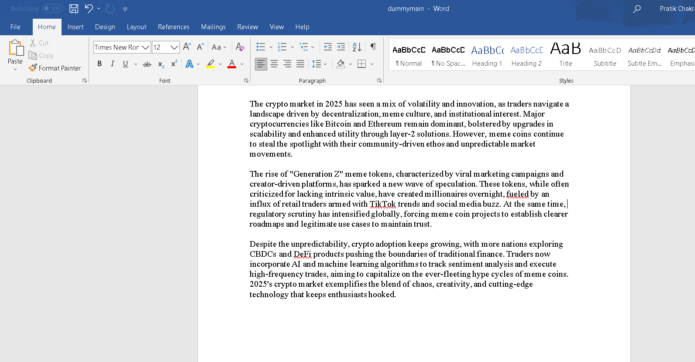
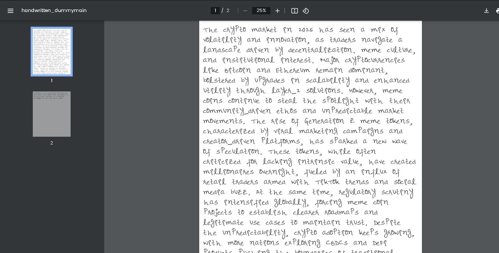

# 📚 Assignment Buddy ✍️

## 📸 See it in Action

### Input Document

### Handwritten Output

> Transform your digital documents into personalized handwritten notes! ✨

## 🌟 Features
- 📝 Convert PDF and DOCX files to handwritten text
- ✨ Multiple handwriting styles
- 📄 Multi-page document support
- 🎯 User-friendly interface
- ⚡ Lightning-fast processing
- 📊 Support for various document sizes
- 🔄 Real-time conversion status

## 🚀 Quick Start

### 📋 Prerequisites
- Python 3.7 or higher
- pip package manager

### ⚙️ Installation

1. Clone this magical repository:

bash
git clone https://github.com/Pratik-uzi/assignment-buddy.git
cd assignment-buddy

2. Install the enchanted dependencies:

bash
pip install -r requirements.txt

3. Launch the application:

bash
python run_apps.py

4. ✨ Open your browser and visit:
   - Main Application: http://localhost:8501
   - API Server: http://localhost:5000

## 🎯 How to Use

1. 📂 Upload your PDF or DOCX file
2. 🔄 Click "Generate Handwritten Notes"
3. ⏳ Wait for the magic to happen
4. ⬇️ Download your handwritten masterpiece!

## 🗂️ Project Structure

assignment-buddy/
├── word/
│ ├── fonts/ # ✍️ Character images
│ ├── app.py # 🖥️ Flask backend
│ ├── st_app.py # 🎨 Streamlit frontend
│ └── w2hw.py # ⚙️ Core conversion logic
├── run_apps.py # 🚀 Launch both servers
├── uploads/ # 📤 Temporary storage :: gets created on execution
├── output/ # 📥 Generated files :: gets created on execution
└── [config files] # ⚙️ Configuration

## 🤝 Contributing

We love your input! 💖 We want to make contributing to Assignment Buddy as easy and transparent as possible. Check out our [Contributing Guide](CONTRIBUTING.md) to get started!

## 🐛 Found a Bug?

If you've found a bug or want to request a new feature:
1. 🔍 First, search existing issues
2. 📝 If it's new, create an issue with a clear description
3. 🔗 Include steps to reproduce the bug
4. 📸 Add screenshots if possible

## 📜 License

This project is licensed under the MIT License - see the [LICENSE](LICENSE) file for details.

## 💖 Support

Love Assignment Buddy? Give us a star ⭐ and share with your friends!

## Acknowledgments :D

FONTS:https://github.com/Pranav082001/Text-to-Handwriting.git

